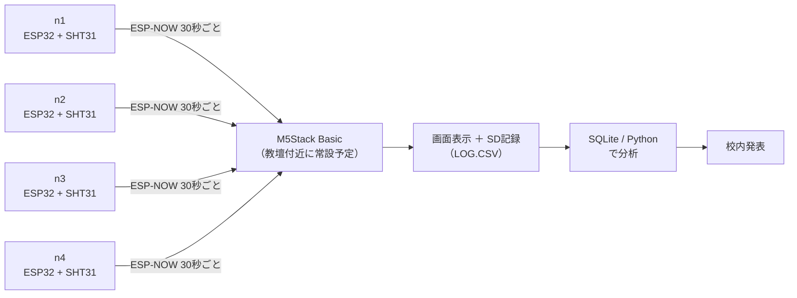

# 教室の温度ムラ「見える化」

訓練校のチーム制作（自主活動・授業時間外）として、教室内の温度ムラをセンサーで可視化するプロジェクトです。
ESP32ノード×4台が教室内の複数地点で温湿度を測り、教壇のM5Stackに無線で集約、画面表示とSD記録を経てデータ分析まで行います。
メンバー全員がIT未経験からのスタートで、就活に向けた実績づくりを主目的にしています。
2026年8月17日のDay 0でチーム開発を開始し、8月28日に完成デモ、9月上旬に校内発表を予定しています。

## システム構成



## リポジトリ構成

```
classroom-temp-map/
├── firmware/
│   ├── node-template/      # ノード側の雛形（コピーして使う。書き換えるのはconfig.hとreadSensor()のみ）
│   │   ├── node-template.ino
│   │   └── config.h
│   ├── nodes/               # 各メンバーが node-template をコピーして育てる置き場（Day 0以降に作成）
│   │   ├── n1/               # 【担当者名】
│   │   ├── n2/               # 【担当者名】
│   │   ├── n3/               # 【担当者名】
│   │   └── n4/               # 【担当者名】
│   └── gateway/              # 集約側（M5Stack Basic）。表示とSD記録を担当
│       ├── gateway.ino
│       └── config.h
├── docs/
│   ├── data-contract.md      # ノード⇄集約の通信・データ形式の約束事
│   ├── setup-windows.md      # 開発環境セットアップ手順（Windows）
│   ├── day0-agenda.md        # Day 0（初回）の進め方
│   ├── git-primer.md         # Git素振りメニュー＆チーム用チートシート
│   ├── tasks-initial.md      # 初期タスク一覧（Issue登録用の台帳）
│   ├── backlog.md            # 拡張バックログ（前倒し時にこの順で着手）
│   └── presentation-outline.md  # 校内発表の構成案
├── analysis/
│   ├── log_to_sqlite.py      # LOG.CSV→SQLite取り込み＋基本集計（標準ライブラリのみ）
│   ├── README.md             # 分析担当の作業手順
│   └── sample/LOG.CSV        # 動作確認用ダミーデータ
├── day0/                     # Day 0のGit演習で各自が作る自己紹介ファイル置き場（演習時に作成）
├── .github/
│   ├── ISSUE_TEMPLATE/task.md
│   └── pull_request_template.md
└── .gitignore
```

## はじめかた

開発環境の準備は事前宿題です（Day 0は放課後45〜60分しかないため、当日は動作確認から始めます）。

- 環境構築 → [docs/setup-windows.md](docs/setup-windows.md)
- Day 0当日の進め方 → [docs/day0-agenda.md](docs/day0-agenda.md)

## データ契約

ノードと集約M5Stackの間の約束事は [docs/data-contract.md](docs/data-contract.md) に定義しています。要点だけ書くと：

- 30秒に1回、ESP-NOW（ユニキャスト・チャンネル1固定・暗号化なし）でJSONを送信。送達確認NGなら1秒後に1回だけ再送。
- ペイロード例：`{"v":1,"id":"n1","seq":123,"t":26.4,"h":55.2}`（読み取り失敗時は`t`/`h`の代わりに`err:"sensor"`）。
- 集約側はSDカードの `LOG.CSV` に生値のまま1行ごとフラッシュで記録（列：`recv_time,clock,node_id,seq,temp_c,hum_pct,status`）。校正補正は表示・分析時に適用する。

## チームの決めごと

### Git運用

- feature branch を切る → Pull Request を出す → 企画者がレビュー → マージ
- `main` への直接pushは禁止
- ツールはgitコマンド＋VSCode（GitHub Desktopは使わない）

### AIルール

1. 共通テンプレートを使う（各自のノードは `firmware/node-template/` をコピーして始める）
2. データ形式の契約を守る（`docs/data-contract.md` のフィールドを勝手に増やさない。変えたいときはチームで合意してから版を上げる）
3. 説明できないコードはマージしない（AIに書かせた部分も含めて、PRの説明欄に自分の言葉で書く）
4. AI利用箇所を記録する（日々の記録はPR説明欄 → 企画者が「AI活用の記録」節に要約を転記）

## 役割分担表

| 役割 | 担当 | 補足 |
|---|---|---|
| 企画・全体とりまとめ | 【 】 | テンプレート整備・レビュー・伴走。**他メンバーの**ノード実装と発表スライド本体には手を出さない（自分のノード1台は担当する） |
| ノード担当（n1〜n4） | 【 】【 】【 】【 】 | 企画者含め1人1台。センサー実装・設置・動作確認。3名チームの場合、余る1台は予備または測定点追加に回す |
| 集約表示オーナー | 【 】（企画者が伴走） | M5Stack側の画面表示・SD記録 |
| データ分析 | 【 】 | 訓練校で学んだSQLiteの活用 |
| 発表とりまとめ | 【 】 | 校内発表用スライドの作成 |
| 筐体（拡張・余力があれば） | 【 】 | ノードのケース化など |

※ 人数（3〜4名）に応じて、1人が複数の役割を兼ねることがあります。

## ノードと設置場所

| ノードID | 設置場所 | 担当 |
|---|---|---|
| n1 | 【未定】 | 【 】 |
| n2 | 【未定】 | 【 】 |
| n3 | 【未定】 | 【 】 |
| n4 | 【未定】 | 【 】 |

## 機材と費用

- センサーノード一式（秋月電子で発注済み・2026-08-01）：¥13,110
- microSDカード（KIOXIA KCA-MC016GS 16GB）：約¥900
- 機材は企画者が用意。プロジェクト終了後（9月の発表・運用終了後）に譲渡を希望するメンバーは実費¥3,500/台

## AI活用の記録

チームルール4（AI利用箇所をREADMEに明記する）の実践場所です。

- 共通テンプレート（`firmware/node-template/`・`firmware/gateway/`）、データ契約のドラフト（`docs/data-contract.md`）、このREADMEはClaudeで下書きを生成し、企画者が内容をレビュー・修正して確定しています。
- 各メンバーが自分のノード（`firmware/nodes/n1`〜`n4`）でAIを使った場合は、そのPRの説明欄（`AIを使った箇所`）に個別に記録します。ルール3のとおり、AIに書かせた部分も自分の言葉で説明できることが前提です。
- PR説明欄の記録は、中間デモ（8/21）とKPT（8/28）のタイミングで企画者がこの節に要約として転記します（記録の散逸防止）。
