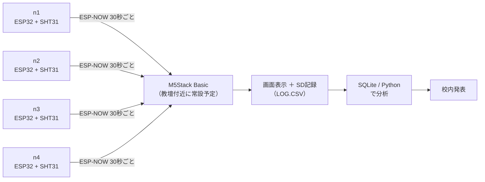

# 教室の温度ムラ「見える化」

訓練校のチーム制作（自主活動・授業時間外）として、教室内の温度ムラをセンサーで可視化するプロジェクトです。
ESP32（無線通信ができる小型マイコンです。マイコンとは、プログラムで動く小さなコンピューターのことです）を使ったノード（教室に置く測定係の小さなコンピューターです。ESP32＋温湿度センサーのセットで、n1〜n4の4台があります）が、教室内の複数地点で温湿度を測ります。教壇のM5Stack（画面つきの小型マイコンです。教壇に置いて受信データを表示・記録します）に無線で集約したうえで、画面表示とSD記録を経てデータ分析まで行います。
メンバーは今回が初めてのチーム開発で、実際に手を動かして完成させる経験を積み、就活で語れる実績につなげることを目的にしています。
2026年8月17日のDay 0でチーム開発を開始し、9月4日に完成デモ、9月中旬に校内発表を予定しています。

## システム構成

図中のSHT31は、温度と湿度を測るセンサー部品の型番です。



## リポジトリ構成

リポジトリ（プロジェクト一式の保管場所です。フォルダごと、変更履歴つきで置いてあります）の全体は次のとおりです。

```
classroom-temp-map/
├── firmware/
│   ├── node-template/      # ノード側の雛形（コピーして使う。書き換えるのはconfig.hとreadSensor()のみ）
│   │   ├── node-template.ino
│   │   └── config.h
│   ├── nodes/               # 各メンバーが node-template をコピーして育てる置き場（Day 0以降に作成）
│   │   ├── n1/               # 【担当者名】
│   │   ├── n2/               # 【担当者名】
│   │   ├── n3/               # 【担当者名】
│   │   └── n4/               # 【担当者名】
│   └── gateway/              # 集約側（M5Stack Basic）。表示とSD記録を担当
│       ├── gateway.ino
│       └── config.h
├── docs/
│   ├── data-contract.md      # ノード⇄集約の通信・データ形式の約束事
│   ├── setup-windows.md      # 開発環境セットアップ手順（Windows）
│   ├── day0-agenda.md        # Day 0（初回）の進め方
│   ├── afterschool-plan.md   # 放課後1時間の時間割と週ごとのゴール
│   ├── task-cards.md         # タスクカード（Issue）の見かた・作り方
│   ├── git-primer.md         # Git素振りメニュー＆チーム用チートシート
│   ├── tasks-initial.md      # 初期タスク一覧（Issue登録用の台帳）
│   ├── backlog.md            # 拡張バックログ（前倒し時にこの順で着手）
│   ├── presentation-outline.md  # 校内発表の構成案
│   └── scope-cut-order.md    # 完成が危ういときに削る順序（8/28・9/2の判断基準）
├── analysis/
│   ├── log_to_sqlite.py      # LOG.CSV→SQLite取り込み＋基本集計（標準ライブラリのみ）
│   ├── README.md             # 分析担当の作業手順
│   └── sample/LOG.CSV        # 動作確認用ダミーデータ
├── day0/                     # Git演習（8/18）で各自が作る自己紹介ファイル置き場（演習時に作成）
├── .github/
│   ├── ISSUE_TEMPLATE/task.md
│   └── pull_request_template.md
└── .gitignore
```

## はじめかた — どの資料を、いつ読むか

開発環境の準備は、**自宅PC分が事前宿題**です。**学校PC分はDay 0（8/17）の残り時間と8/18（火）・8/20（木）の放課後にチームで導入します**。Day 0当日は役割の合意と機材配布が中心で、Git演習は8/18に行います（実機の動作確認は8/17週の放課後に順次進めます→[docs/tasks-initial.md](docs/tasks-initial.md) のM2）。

資料は多めにありますが、**全部読む必要はありません**。下の表の、いまの自分に当てはまる行だけ読めば大丈夫です。

| いつ・誰が | 読むもの | 補足 |
|---|---|---|
| いま（事前宿題） | [docs/setup-windows.md](docs/setup-windows.md)・[docs/setup-discord.md](docs/setup-discord.md) | 済んだ人は読み直し不要です |
| 8/18のGit演習まで | [docs/git-primer.md](docs/git-primer.md) の**第2部だけ** | 第1部は企画者の練習用です（読まなくてOK） |
| 放課後の流れを知りたいとき | [docs/afterschool-plan.md](docs/afterschool-plan.md) | 1回ざっと見れば十分です |
| 自分の役割が決まったら | [docs/roles.md](docs/roles.md) の自分の行、[docs/tasks-initial.md](docs/tasks-initial.md) の自分のタスク | 他の人の分は読まなくてOKです |
| 自分のノードを作るとき | [docs/data-contract.md](docs/data-contract.md)・[docs/first-boot-check.md](docs/first-boot-check.md) のA章 | ノード担当全員（8/17週〜） |
| データ分析をするとき | [analysis/README.md](analysis/README.md) | 分析担当向けです |

**次の5つは、ふだん読まなくていい資料です**（必要な場面になったら企画者が案内します）：
[docs/day0-agenda.md](docs/day0-agenda.md)（Day 0の進行台本。当日は企画者が進めます）／[docs/task-cards.md](docs/task-cards.md)（Issueの見かたに迷ったとき用）／[docs/backlog.md](docs/backlog.md)（前倒しできたときの追加機能）／[docs/presentation-outline.md](docs/presentation-outline.md)（3週目の発表準備で使います）／[docs/scope-cut-order.md](docs/scope-cut-order.md)（完成が危ういときだけ）

## データ契約

ノードと、集約役のM5Stack（ゲートウェイとも呼びます。4台のノードからデータを受け取ってまとめる係です）の間の約束事は [docs/data-contract.md](docs/data-contract.md) に定義しています。要点だけ書くと：

- 30秒に1回、ESP-NOW（WiFiルーターなしでESP32どうしが直接データを飛ばせる無線のしくみです）を使って送信します。ユニキャスト（その場の全員に向かって叫ぶのではなく、宛先を1台決めて送る方式です）で送り、チャンネル（無線の通り道の番号です。トランシーバーの「チャンネルを合わせる」と同じ考え方です）は1に固定、暗号化はなしです。データの形式はJSON（ジェイソン。「項目名:値」をカンマで並べる、機械が読み間違えないためのデータの書き方です）を使います。送達確認がNGの場合は、1秒後に1回だけ再送します。
- ペイロード（1回の送信で運ぶデータの中身です）例：`{"v":1,"id":"n1","seq":123,"t":26.4,"h":55.2}`（読み下すと「契約の版は1。私はノードn1。起動してから123回目の送信。気温26.4℃、湿度55.2%」という内容です。読み取り失敗時は`t`/`h`の代わりに`"err":"sensor"`を送ります）。
- 集約側はSDカードの `LOG.CSV`（CSV＝カンマ区切りの表形式ファイルです。Excelやスプレッドシートでそのまま開けます）に、生値（生データ。センサーが返した値を補正せずそのまま記録したものです）のまま1行ごとフラッシュ（flush。書き込み待ちのデータをその場でSDカードに確定させることです。突然電源が切れても消えないようにします）で記録します（列：`recv_time,clock,node_id,seq,temp_c,hum_pct,status`）。校正補正は画面表示にのみ適用します（分析時に適用するかは未決定です→docs/backlog.md 項目4）。

## チームの決めごと

ここにある決めごとは企画者が用意した叩き台です。Day 0で確認して確定し、9/4のKPT（ふりかえりの型です。Keep＝続けること・Problem＝困ったこと・Try＝次に試すこと、の3つで振り返ります）で見直します。

### Git運用

GitHub（書いたプログラムの変更履歴を記録・共有できるWebサービスです）上でチーム開発を進めます。

- Git運用の流れは「ブランチを切る → PRを出す → 企画者レビュー → マージ」です。ブランチ（feature branch）とは、本体（main）に影響を与えずに作業するための、枝分かれした作業用コピーです。PR（Pull Request）とは、「この変更を本体に取り込んでください」という提案で、チームの誰かが確認してから取り込みます。マージとは、提案された変更を本体に取り込むことです。
- `main` への直接push（プッシュ：自分のPCでの記録をGitHub側に送って反映することです）は禁止です
- ツールはgitコマンドとVSCodeを使います（GitHub Desktopは使いません）

### AIルール

1. 共通テンプレートを使います（各自のノードは `firmware/node-template/` をコピーして始めます）
2. データ形式の契約を守ります（`docs/data-contract.md` のフィールドを勝手に増やしません。変えたいときはチームで合意してから版を上げます）
3. 説明できないコードはマージしません（AIに書かせた部分も含めて、PRの説明欄に自分の言葉で書きます）
4. AI利用箇所を記録します（日々の記録はPR説明欄に書き、発表とりまとめ担当が「AI活用の記録」節の表に転記します。企画者は内容をレビューで確認します）

使いどころの目安は次のとおりです。エラーメッセージの解読・コードの意味の説明・文章や表の下書きには積極的に使ってOKです。コードを丸ごと生成させて、自分で説明できないまま持ち込むのはNGです（ルール3のとおり）。

### 週次リズム

- 月曜: 週次キックオフ15分（今週の各自のタスクカード＝Issue（やることを1件ずつカードにしたものです）を確認します。カードの見かた・作り方は [docs/task-cards.md](docs/task-cards.md)）
- 毎日: Discordに2行報告します（きょうやった／困ってる）。書くだけでOKです。返信は必須にしません
- 金曜: 中間デモ（8/21・8/28）です。進捗の判定はこの場でだけ行います。9/4(金)は完成デモ＋ふりかえり（KPT）です
- 詰まったら24時間以内に申告してください→企画者と30分ペア作業します。遅れは責めません（タスクの切り方が悪かったとみなして分解し直します）
- 時間の上限は週5〜8hです。上限は超えません（作業量は役割ごとに波がありますが、上限と見える化で揃えます）
- 完成が危うくなったら、あらかじめ決めた順に規模を削ります（順序は [docs/scope-cut-order.md](docs/scope-cut-order.md) 参照）

## 役割分担表

| 役割 | 担当 | 補足 |
|---|---|---|
| 企画・全体とりまとめ | 【 】 | テンプレート整備・レビューを行います。**他メンバーの**ノード実装と発表スライド本体には手を出しません（自分のノード1台は担当します） |
| ノード担当（n1〜n4） | 【 】【 】【 】【 】 | 企画者を含めて1人1台です。センサー実装・設置・動作確認を行います |
| 集約表示オーナー | 【 】 | M5Stack側の画面表示・SD記録を担当します。担当者はノード1台と兼務します（4名全員がノード1台ずつ担当するためです）。M5Stackは企画者の個人所有物のため、譲渡の対象外です |
| データ分析 | 【 】 | 訓練校で学んだSQLite（ファイル1つで使える小さなデータベースです）を活用します |
| 発表とりまとめ | 【 】 | 校内発表用スライドを作成します |
| 筐体 | 【 】 | ノードのケース化などを行います。基本は企画者が担当しますが、やってみたい人がいればその人が正式な担当になります（他の役割と同格です） |

※ 1人が複数の役割を兼ねることがあります。担当欄はGitHubのユーザー名で記入します（公開リポジトリのため本名は書きません）。

## ノードと設置場所

| ノードID | 設置場所 | 担当 |
|---|---|---|
| n1 | 【未定】 | 【 】 |
| n2 | 【未定】 | 【 】 |
| n3 | 【未定】 | 【 】 |
| n4 | 【未定】 | 【 】 |

## 機材と費用

- センサーノード一式（秋月電子で発注済み・2026-08-01）：¥13,110
- microSDカード（LAZOS 16GB Class10）：約¥1,000
- 機材は企画者が用意します。プロジェクト終了後（9月の発表・運用終了後）に譲渡（センサーノードのみ。集約のM5Stackは対象外です）を希望するメンバーは、実費¥3,500/台です

## AI活用の記録

チームルール4（AI利用箇所をREADMEに明記します）の実践場所です。

記録は「AIを使った／使っていない」の二択にはしません。**「AIがやったこと」と「人間が判断・検証したこと」を分けて**、下の表の形式で書きます。AIに書かせること自体はルール違反ではありません——ルール3のとおり、自分の言葉で説明できることがマージの条件です。

| どこで | AIがやったこと | 人間が判断・検証したこと |
|---|---|---|
| 共通テンプレート（`firmware/node-template/`・`firmware/gateway/`） | コードの下書きを生成（Claude） | 企画者が仕様（データ契約）を決めてレビュー・修正し、コンパイルと実機の送受信で検証 |
| データ契約のドラフト（`docs/data-contract.md`） | 文書の下書きを生成（Claude） | チームで内容を確認し、企画者の承認でv1として確定 |
| このREADMEと `docs/` の各手順書 | 文章の下書きを生成（Claude） | 企画者が内容をレビュー・修正して確定 |

- 各メンバーが自分のノード（`firmware/nodes/n1`〜`n4`）でAIを使った場合は、そのPRの説明欄（`AIを使った箇所`）に個別に記録します。ルール3のとおり、AIに書かせた部分も自分の言葉で説明できることが前提です。
- PR説明欄の記録は、中間デモ（8/21・8/28）とKPT（9/4）のタイミングで、**発表とりまとめ担当が上の表に転記します**（企画者は内容をレビューで確認します）。記録の散逸を防ぐと同時に、発表スライドの「AIとの付き合い方」の材料づくりを兼ねます。
