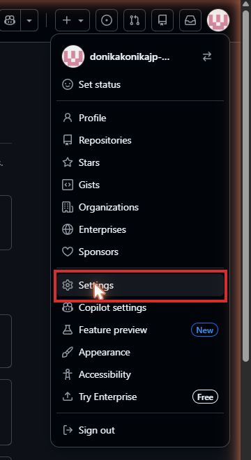
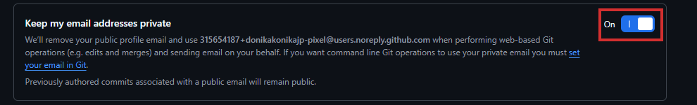
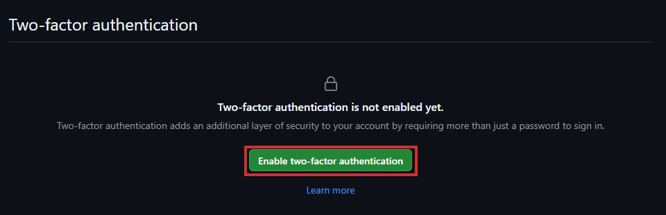
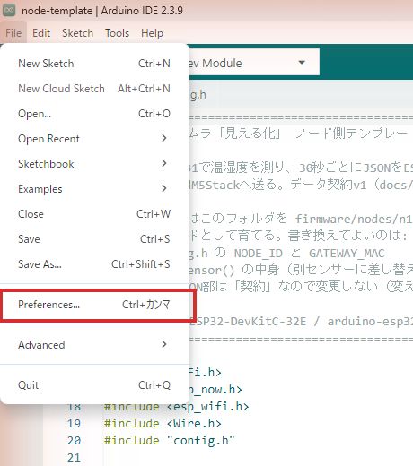
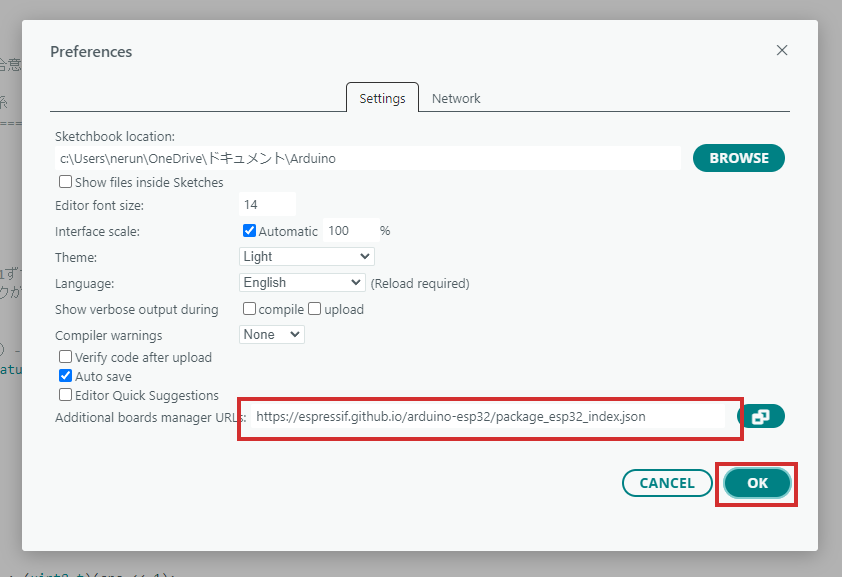
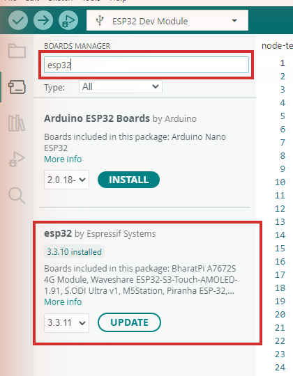
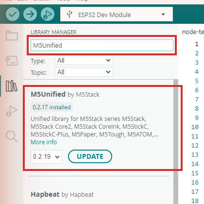
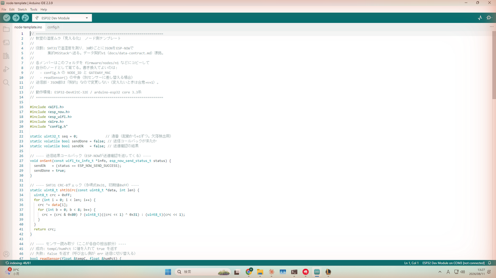
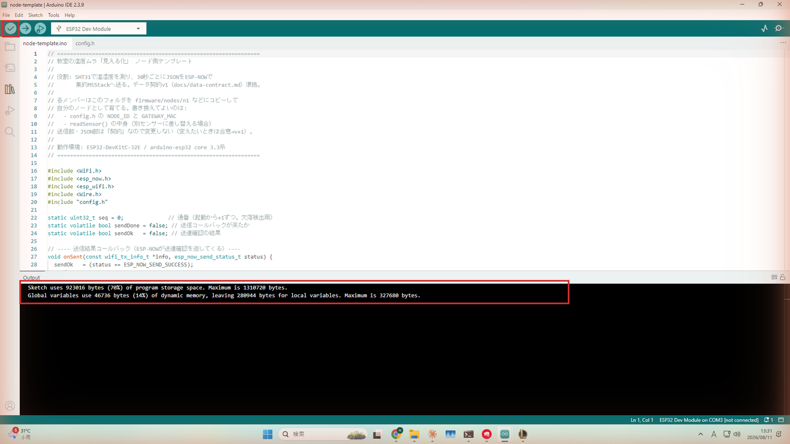
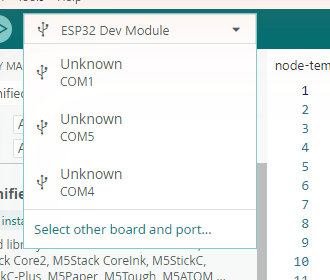

# Windows 11 環境構築手順

このリポジトリ（`classroom-temp-map`）でファームウェアを書き込めるようにするための、Windows 11 向けセットアップ手順です。
**リポジトリ**とは、プロジェクト一式の保管場所（フォルダごと、変更履歴つきで置いておく場所）のことです。
**マイコン**とは、プログラムで動く小さなコンピューターのことです。
**ファームウェア**とは、そのマイコンに書き込むプログラムのことです。

IT経験がなくても、上から順番にやれば完了する粒度で書いています。わからない用語が出てきても、書いてある通りにクリック・入力すれば大丈夫です。

**対象者**：ノード担当（全員。**ノード**＝教室に置く測定係の小さなコンピューターです）＋ 集約表示オーナー（M5Stack担当。**集約**＝4台のノードからデータを受け取ってまとめる係、**M5Stack**＝画面つきの小型マイコンです）
**所要時間の目安**：初回は1.5〜2.5時間（0章のGitHubアカウント作成 約15〜20分を含みます。esp32ボードパッケージのダウンロードにも時間がかかります）
**前提**：Windows 11（64bit）、インターネット接続、自分のPCの管理者権限（ドライバインストールで必要になることがあります）、メールを受信できるメールアドレス（GitHubアカウント作成に使います）
**用意するもの**：USBケーブル（データ通信対応のもの。充電専用ケーブルは使えません）、自分の担当ボード（ノード担当は ESP32-DevKitC-32E、集約担当は M5Stack Basic。**ESP32**＝無線通信ができる小型マイコンです）

> **ボードはDay 0（8/17）に配布します。** 手元に届くまでは、ボードをつなぐ確認（3章の接続確認と7章の書き込み）はできなくてOKです。
> 事前宿題の完了基準は「6章のコンパイル（＝書いたプログラムを機械が実行できる形に変換し、文法ミスがないか確かめること。くわしくは6章）が通ること」までで、これはボードなしでできます。

> **学校PCにも、同じ手順で導入します。** 自宅PC分はこの手順書どおり事前宿題として各自で、学校PC分はDay 0（8/17）の残り時間と8/18（火）の放課後に**チームで一緒に**導入します（私有USBメモリ・個人PCは学校ルールで持ち込み禁止のため、インストーラは各自が学校回線で公式サイトからダウンロードします。回線が混まないよう、開始のタイミングをずらします）。**ただし、学校PCでは0章はやりません。** 0章（GitHubアカウントの作成・メールの非公開設定・二段階認証・ユーザー名の報告）はアカウントに対して1回やれば済むものなので、自宅で終わっていれば学校PCでは不要です。**学校PCでは1章「Arduino IDE 2.x のインストール」から始めてください**（2つ目のアカウントを作ってしまわないよう注意してください）。また、学校のネットワークは**プロキシ**（外部との通信を中継するサーバーです。くわしくは1-2で説明します）を経由する構成のため、**学校PCでは 1-2 と5章の手順4のプロキシ設定が必須です**（やらないと、Arduino IDEが起動画面のまま止まり、cloneやpushも時間切れで失敗します）。学校PCは1人1アカウントなので、5章の初回pushで出るGitHubの認証は、自宅と同じように各自で行って大丈夫です。管理者権限の画面が出て進めなくなったときは、企画者に声をかけてください（8/17に企画者が学校PC1台で導入できるか下見をしました。1-2と5章の手順4のプロキシ設定は、この下見で判明した学校ネットワークの構成を反映した手順です。もしドライバが学校PCに入れられない場合は、**ボードへの書き込みは自宅PCで行い、書き込み済みのボードを学校に持ってくる**運用に切り替えます）。

手順は次の9ステップです。集約担当だけに必要なステップには「（集約担当のみ）」と書いてあります。それ以外は全員共通です。

---

## 0. GitHubアカウントの準備

ここから使う **GitHub** は、書いたプログラムの変更履歴を記録・共有するためのサービスです。まだアカウントを持っていない人はこの章で作成します。すでに持っている人は0-1を飛ばして0-2から確認してください。

### 0-1. アカウントを作成する

1. ブラウザで [https://github.com/](https://github.com/) を開きます。
2. 「Sign up」（新規登録）をクリックします。
3. 案内に沿って、メールアドレス → パスワード → ユーザー名の順に入力します（画面の順番は多少前後することがありますが、案内どおりに入力していけば問題ありません）。

   > **ユーザー名の決め方**：このユーザー名は、これから書くプログラムの変更履歴（コミット履歴）に公開の形で残ります。就活で自分の作品を見せるときの「顔」にもなるので、本名フルネームそのままは避けつつ、面接で見せても恥ずかしくない半角英数字にしましょう（例：名字のローマ字＋数字、イニシャルの組み合わせなど）。あとから変更もできますが、リンクが変わってしまうので、最初にある程度考えて決めておくのが楽です。

4. 登録したメールアドレスに届いた確認コードを画面に入力します（メール認証）。
5. 認証が終わり、GitHubのトップページ（またはダッシュボード画面）が表示されればアカウント作成は完了です。次は0-2に進みます。

   

### 0-2. メールアドレスを非公開にする

初期設定のままだと、これから行う変更履歴（**コミット**＝変更内容の記録。ゲームのセーブポイントのようなものです）に自分のメールアドレスがそのまま記録されてしまいます。公開用の代理アドレスに切り替えておきます。

1. 画面右上のプロフィールアイコンをクリックして「Settings」を開きます。

   
2. 左メニューの「Emails」を開きます。
3. 「Keep my email addresses private」のスイッチをクリックして「On」にします。

   
4. Onにすると、その画面に「番号＋ユーザー名@users.noreply.github.com」の形式のアドレスが表示されます。**このアドレスをメモしておいてください**（あとの手順5「名前とメールを設定する」で使います）。

   

   > こうしておかないと、個人のメールアドレスが公開リポジトリの変更履歴に恒久的に残ってしまうためです。

メモが取れたら次は0-3に進みます。

### 0-3. 二段階認証（2FA）の設定を求められたら

アカウント作成の途中や初回ログイン時に、GitHubから二段階認証の設定を求められることがあります。**2FA（二段階認証）**とは、パスワードに加えてスマホ等でも本人確認する、乗っ取り防止のしくみです。



1. 求められた場合は、慌てず画面の案内に沿って、スマホの認証アプリ（Google Authenticatorなど）等で設定します。
2. 表示される「リカバリーコード」は、あとでログインできなくなったときの命綱になるので、**必ずスマホのカメラで撮影するなどして保存しておいてください**。
3. 求められなかった場合は、このステップは飛ばして0-4に進んでOKです。

### 0-4. ユーザー名を報告する

1. 作成したGitHubのユーザー名を、企画者にLINEで報告します。
2. 企画者はこのユーザー名を使って、あとでリポジトリへの招待を送ります（詳しくは手順5「リポジトリへの招待を受け取る」）。

報告が終わったら0章は完了です。次は1章「Arduino IDEのインストール」に進みます。

---

## 1. Arduino IDE 2.x のインストール

### 1-1. インストールする

1. 公式サイト [https://www.arduino.cc/en/software/](https://www.arduino.cc/en/software/) を開きます。
2. 「Windows」向けのダウンロードボタンを探します（現行バージョンは **Arduino IDE 2.3.10**。サイトを開いた時点でこれより新しいバージョンが表示されていたら、そちらをダウンロードして問題ありません）。ファイル名の目安は `arduino-ide_2.3.10_Windows_64bit.exe` です。
3. 「Just Download」（無料）をクリックしてダウンロードします。寄付を求める画面が出ますが、支払わなくても下の方に無料ダウンロードのリンクがあります。
4. ダウンロードした `.exe` をダブルクリックしてインストールします。表示される画面はすべて既定値のままで進めてOKです（ライセンス同意 → インストール場所 → インストール実行）。途中で「このデバイス ソフトウェアをインストールしますか？」という確認（発行元：Adafruit Industries、Arduino LLC など）が出たら、インストーラー同梱の署名済みUSBドライバなので、すべて「インストール」を選んでOKです。
5. インストール後、Arduino IDE を一度起動します。
   - **自宅PC**：エディタ画面（メニューとコード欄のある画面）が開けば、この章は完了です。
   - **学校PC**：ロゴが脈動する画面のまま止まりますが、**故障ではありません**（インストールをやり直しても直りません）。そのまま右上の✕で閉じて、次の1-2に進んでください。

> 補足：このインストーラーは USB ドライバも一部まとめて入れてくれることがあります。まず手順3（USBドライバ）の「確認」だけ先にやってみて、デバイスマネージャーに `COM` 番号（**COMポート**＝PCがUSB機器と会話するための接続口の番号です。COM3など）が出ていれば、そのステップの手動インストールは不要です。

### 1-2. 学校PCのみ：プロキシを設定する

**自宅PCではこの節は不要です（実行しないでください）。2章に進んでOKです。**

学校のネットワークは、**プロキシ**（外部との通信をいったん引き受けて中継するサーバーです。学校や会社のネットワークでよく使われます）を経由しないと外部と通信できない構成になっています。ブラウザはプロキシの場所を知っていますが、Arduino IDE は知らないため、そのままでは起動時の通信がすべて時間切れになり、ロゴが脈動する画面のまま何分も止まります（2026-08-17の学校PC下見で確認した実症状です）。

ここでは、IDE用の設定ファイルにプロキシの場所を書いて教えます。**学校のシステム設定を変える操作ではありません**——編集するのは自分のユーザーフォルダ内にあるIDE用の設定ファイルで、IDEの設定画面（`基本設定` → `ネットワーク`）が書き込むのと同じファイルです。

1. まず、学校のプロキシの「IPアドレス」と「ポート番号」を控えます。`Windowsキー + I` で設定を開き、`ネットワークとインターネット` → `プロキシ` → 「手動プロキシ セットアップ」の「**編集**」をクリックすると、「プロキシ IP アドレス」（`192.168.0.250` のような数字4組）と「ポート」（`8080` のような数字）が表示されるので、**2つともメモします**。メモしたら「キャンセル」で閉じてください（値を変えたり保存を押したりはしません。見てメモするだけです）。
2. まだ一度も Arduino IDE を起動していない場合は、一度起動して✕で閉じます（1-1の手順5です。ロゴ画面のまま止まってOKです。この初回起動で、設定ファイルの置き場が自動で作られます）。すでに起動したことがあれば、いまIDEが閉じていることだけ確認します。
3. `Windowsキー + R` を押し、次を貼り付けてEnterを押します（メモ帳で設定ファイルが開きます）。

   ```
   notepad %UserProfile%\.arduinoIDE\arduino-cli.yaml
   ```

4. 開いた中身を**全部消して**、次の4行に丸ごと置き換えます。

   ```yaml
   board_manager:
     additional_urls: []
   network:
     proxy: http://192.168.0.250:8080
   ```

   > **⚠ このままコピーして貼らないでください。** 最後の行の `192.168.0.250` と `8080` の部分は、**手順1でメモした自分の学校の値に書き換えます**。行頭の字下げ（半角スペース2個）はこの形のまま崩さないでください。

   （読み下し：下2行が「外部と通信するときは、このプロキシを経由せよ」という指示です。）

5. `Ctrl + S` で保存して、メモ帳を閉じます。
6. Arduino IDE をもう一度起動します。今度はロゴ画面を数十秒以内に抜けて、エディタ画面が開けば成功です。開かない場合は、8章の表を確認したうえで企画者に連絡してください。

---

## 2. ボードマネージャーURLの追加 → esp32パッケージ 3.3.11 のインストール

1. Arduino IDE を開き、左上メニューの `ファイル`（File）→ `基本設定`（Preferences）を開きます（ショートカット `Ctrl+,` でも可）。

   
2. 「追加のボードマネージャのURL」（Additional boards manager URLs）の欄に、以下のURLを貼り付けます。

   ```
   https://espressif.github.io/arduino-esp32/package_esp32_index.json
   ```

   すでに他のURLが入っている場合は、改行またはカンマ区切りで追記します（上書きしないでください）。

3. 「OK」をクリックして設定画面を閉じます。

   
4. 左側の縦アイコンの中から「ボードマネージャ」（Boards Manager、四角が積み重なったアイコン）をクリックします。
5. 検索欄に `esp32` と入力すると、「**esp32 by Espressif Systems**」が出てきます。

   

   ※画像は撮影した環境に導入済みのため「UPDATE」表示ですが、初めてのインストールでは「INSTALL」と表示されます（押すボタンの位置は同じです）。
6. バージョン選択のドロップダウンから **3.3.11** を選び、「インストール」（Install）をクリックします。

   **これは数百MB〜1GB以上のダウンロードになるため、環境によっては10〜30分ほどかかります。** インストール中はPCの電源とネット接続を切らないでください。途中で止まっているように見えても、進捗バーが動いていれば待ってOKです。

7. インストール完了後、一覧に `esp32 (3.3.11)` と表示されていれば成功です。

---

## 3. USBドライバのインストール

> ボードがまだ手元に無い期間（Day 0前）は、この章は**ドライバのダウンロード〜インストールまで**（3-1の手順3〜7）進めておけばOKです。ボードをつないで確認する手順（3-1の手順1〜2と8、3-2）は、Day 0でボードを受け取ってから行ってください。

### 3-1. ノード用（ESP32-DevKitC-32E）＝ CP210x ドライバ（全員）

1. ESP32-DevKitC-32E をUSBケーブルでPCに接続します。
2. `Windowsキー` を右クリックして「デバイスマネージャー」を開きます。「ポート (COM と LPT)」の項目を確認します。
   - すでに `Silicon Labs CP210x USB to UART Bridge (COMx)` のように表示されていれば、ドライバは入っているのでこのステップは完了です。次（3-2または手順4）に進んでOKです。
   - 何も表示されない／「ほかのデバイス」に「!」マーク付きで出ている場合は、以下の手動インストールに進みます。
3. 公式サイト [https://www.silabs.com/software-and-tools/usb-to-uart-bridge-vcp-drivers](https://www.silabs.com/software-and-tools/usb-to-uart-bridge-vcp-drivers) を開きます。
4. 「Downloads」タブから、Windows向けの VCP ドライバ（zip）をダウンロードします。
5. ダウンロードしたzipを右クリックして「すべて展開」で解凍します。
6. 解凍したフォルダの中から `CP210xVCPInstaller_x64.exe`（64bit Windows 11用）を実行し、インストールを進めます。
7. インストール後、PCの再起動を求められたら再起動します。
8. もう一度デバイスマネージャーの「ポート (COM と LPT)」を確認し、`Silicon Labs CP210x USB to UART Bridge (COMx)` が出ていればOKです。この `COMx` の番号は手順7で使うのでメモしておいてください。

### 3-2. 集約用（M5Stack Basic）＝ CH9102 または CP2104（集約担当のみ）

M5Stack Basic は製造時期によって、USB通信用のチップが **CH9102** または **CP2104** のどちらかになっています（見た目では区別できません）。まず上の3-1と同じ手順で CP210x ドライバをインストールした状態でM5Stack Basicを接続し、デバイスマネージャーに `COM` 番号が出るか確認してください。

- **出た場合**：CP2104チップです（CP210xドライバでカバーされます）。追加作業は不要です。
- **出ない／認識されない場合**：CH9102チップです。M5Stack公式ドキュメント [https://docs.m5stack.com/en/download](https://docs.m5stack.com/en/download) のドライバ配布ページから CH9102 用ドライバ（Windows用インストーラ）をダウンロードして実行し、案内に従ってインストールしてください。インストール後、再度デバイスマネージャーで `COM` 番号が出るか確認します。

---

## 4. M5Unified ライブラリのインストール（集約担当のみ）

ノード担当は追加ライブラリ不要のため、このステップは飛ばしてOKです。

1. Arduino IDE の左側の縦アイコンから「ライブラリマネージャ」（本のアイコン）を開きます。
2. 検索欄に `M5Unified` と入力します。
3. 「**M5Unified** by M5Stack」を選び、「インストール」をクリックします。

   

   ※画像は撮影した環境に導入済みのため「UPDATE」表示ですが、初めてのインストールでは「INSTALL」と表示されます。
4. 依存ライブラリ（M5GFXなど）を一緒にインストールするか聞かれたら「Install All」を選びます（M5UnifiedはM5GFXに依存しており、自動で入ります）。
5. インストール完了後、ライブラリ一覧に `M5Unified` が表示されていればOKです。

---

## 5. リポジトリの clone（Git for Windows + VSCode）

ここでは、GitHub上のリポジトリを自分のPCへ丸ごと複製する「**clone（クローン）**」を行います。

1. **Git for Windows** を公式サイト [https://git-scm.com/download/win](https://git-scm.com/download/win) からダウンロードし、インストールします。インストール画面はほぼすべて既定値のままでOKです（「Git from the command line and also from 3rd-party software」が選ばれている状態が既定です。変更不要です）。
2. **VSCode（Visual Studio Code）** を公式サイト [https://code.visualstudio.com/download](https://code.visualstudio.com/download) からダウンロードし、インストールします（Windows x64 User Installer、管理者権限不要のもので問題ありません）。
3. VSCode を開き、メニュー `ターミナル`（Terminal）→ `新しいターミナル`（New Terminal）でターミナルを開きます。**タブ名が「powershell」（プロンプトが `PS C:\...>` の形）であることを確認してください。**「cmd」になっている場合は、ターミナル右上「＋」の隣の「∨」→「既定のプロファイルの選択」→「PowerShell」を選んでから、もう一度新しいターミナルを開きます（この資料のコマンドは `$HOME` などPowerShell前提のため、cmdでは動きません）。
4. **学校PCのみ**：Git にもプロキシを設定します（**自宅PCでは実行しないでください**）。1-2と同じ理由で、Git も学校のプロキシを知らないと外部と通信できません。ターミナルに以下を入力してEnterを押します。

   ```
   git config --global http.proxy http://192.168.0.250:8080
   ```

   > **⚠ このままコピーして貼らないでください。** `192.168.0.250` と `8080` の部分は、1-2の手順1でメモした自分の学校の値に書き換えます。

   （読み下し：Gitに「外部と通信するときは、このプロキシを経由せよ」という設定を、この先ずっと使う設定として登録します。これをしないと、次のcloneや、8/18のGit演習でのpushが時間切れで失敗します。）

   > 間違えて自宅PCで実行してしまった場合は、`git config --global --unset http.proxy` を実行すると取り消せます。

5. リポジトリを置きたい場所（例：`ドキュメント` フォルダ）に移動します。ターミナルに以下を入力してEnterを押してください。

   ```
   cd $HOME\Documents
   ```

   （読み下し：`cd` は「このフォルダに移動する」という命令です。`$HOME` は自分のユーザーフォルダ（`C:\Users\自分の名前`）を表す省略記法なので、この1行で「自分のドキュメントフォルダに移動する」という意味になります。）

   > 別の場所に置きたい場合は `Documents` の部分を変えてください。いま自分がどこにいるか分からなくなったら `pwd` と入力すると現在地が表示されます。

6. 続けて、以下を入力してEnterを押します。

   ```
   git clone https://github.com/rei-okabayashi/classroom-temp-map.git
   ```

   （読み下し：GitHub上の `classroom-temp-map` リポジトリを、いまいる場所に丸ごと複製します。）

7. clone が終わったら、VSCode の `ファイル`（File）→ `フォルダーを開く`（Open Folder）で、clone してできた `classroom-temp-map` フォルダを開きます。

### 名前とメールを設定する

Gitに「誰の変更か」を教えるための設定です。これをしておかないと、初めてcommitしようとしたときに `Please tell me who you are` というエラーで止まってしまいます。

1. VSCode のターミナル（上の手順3で開いたもの）に、以下を1行ずつ入力してEnterを押します。

   ```
   git config --global user.name "ここに自分のGitHubユーザー名"
   git config --global user.email "ここに0-2でメモしたnoreplyアドレス"
   ```

   > **⚠ このままコピーして貼らないでください。** 引用符 `"` の中は、**自分の値に丸ごと書き換えます**。<br>
   > 例：ユーザー名が `taro-y` で、0-2でメモしたアドレスが `12345678+taro-y@users.noreply.github.com` なら、こう打ちます。
   >
   > ```
   > git config --global user.name "taro-y"
   > git config --global user.email "12345678+taro-y@users.noreply.github.com"
   > ```

   （読み下し：1行目でGitに「あなたの名前」を、2行目で「あなたのメールアドレス」を、この先ずっと使う設定として登録します。）

2. 以下を実行します。

   ```
   git config --global --list
   ```

   （読み下し：いま登録した設定の一覧を画面に表示します。）

   出力に `user.name=...` と `user.email=...` の2行が含まれていて、**`=` の右側が自分の値になっていればOK**です。
   `user.name=ここに自分のGitHubユーザー名` のように説明文がそのまま入っていたら、書き換えずにコピーしてしまっています。手順1をやり直してください（同じコマンドをもう一度実行すれば上書きされます）。

### リポジトリへの招待を承諾する（もう届いています）

このリポジトリは企画者が作成し、あとからメンバーを招待する形になっています。**招待はすでに送信済みです。**

1. 「invited you to collaborate」という件名のメールが、登録したメールアドレス宛に届いているはずです。
2. メール本文の「Accept invitation」ボタンを押します。
3. メールが見当たらない場合は、[https://github.com/notifications](https://github.com/notifications) を開いて確認してください。ここからでも承諾できます。
4. **承諾しないと push（自分の変更のアップロード）ができません。** ただし clone（複製）は承諾していなくてもできてしまうので、「cloneできたから大丈夫」とは判断せず、上の1〜3で承諾できているかを確かめてください。承諾したかどうか分からないときは、企画者にLINEで連絡してください。

### 初回pushでは認証画面が出る（予告）

8/18(火)のGit演習で初めて `git push` を実行すると、一度だけブラウザが自動で開き、GitHubへのサインインと許可（Authorize）を求められます。

1. 0章で作成したアカウントでログインします。
2. 内容を確認して許可（Authorize）します。
3. ブラウザからターミナルに戻ると、pushが完了しています。
4. 2回目以降のpushでは、この確認は出ません（自動で認証されます）。

---

## 6. node-template を開いて検証（コンパイル）する

ここでは、書いたプログラムを機械が実行できる形に変換し、文法ミスがないか確かめる「**コンパイル（検証）**」を行います。

1. **Arduino IDE** を開きます（VSCodeではなくArduino IDEを使います）。
2. `ファイル`（File）→ `開く`（Open...）で、clone した `classroom-temp-map` フォルダの中の `firmware/node-template/node-template.ino` を開きます。

   
3. 上部メニューの `ツール`（Tools）→ `ボード`（Board）→ `esp32` の中から「**ESP32 Dev Module**」を選択します。
4. 画面左上のチェックマークのアイコン（検証/コンパイル）をクリックします。
5. 下側の出力ウィンドウに赤いエラーが出ず、最後に「コンパイルが完了しました」（Done compiling）「スケッチが使用しているプログラム領域は...」のようなメッセージが出れば成功です（英語表示の場合は `Sketch uses ... bytes` の2行です）。

   

初回はコンパイルに数分かかることがあります（手順8のトラブルシュートも参照してください）。

### 集約担当のみ：gateway も検証する

1. 同じ手順で `firmware/gateway/gateway.ino` を開きます。
2. `ツール`（Tools）→ `ボード`（Board）→ `esp32` の中から「**M5Core**」を選択します（M5Stack Basic用のボード設定です）。
3. 検証（コンパイル）が通ることを確認します。手順4の M5Unified が入っていないと `M5Unified.h: No such file or directory` エラーになるので、その場合は手順4に戻ってください。

---

## 7. 実機への書き込みとシリアルモニタでの確認

ここでは、コンパイルしたプログラムをUSBケーブル経由でボードに転送する「**書き込み**」と、マイコンが出すメッセージをPCの画面で見るための窓である「**シリアルモニタ**」での確認を行います。

1. ESP32-DevKitC-32E をUSBケーブルでPCに接続します（手順3-1のドライバが入っている状態です）。
2. `ツール`（Tools）→ `シリアルポート`（Port）から、手順3-1でメモした `COMx` を選択します。

   

   ※画面上部のボード名右の▼からも選べます。ボード名が「Unknown」と表示されても、手順3-1でメモしたCOM番号と一致していればそれを選んで問題ありません。
3. 画面左上の右矢印アイコン（マイコンボードに書き込む／Upload）をクリックします。
4. 出力ウィンドウに `Hard resetting via RTS pin...` や `Leaving...` のようなメッセージが出て、赤いエラーなく終われば書き込み成功です（うまくいかない場合は手順8の表を参照してください）。
5. `ツール`（Tools）→ `シリアルモニタ`（Serial Monitor）を開きます（虫眼鏡アイコン、または `Ctrl+Shift+M`）。
6. シリアルモニタ画面の右下にある通信速度のドロップダウンを **115200 baud** に合わせます。
7. 以下のような出力が表示されれば、書き込みと動作確認は完了です。

   ```
   === onmura node ===
   NODE_ID=n1  schema v1
   my MAC: xx:xx:xx:xx:xx:xx
   ```

   （読み下し：このノードが起動したことを知らせる見出し行は「onmura node」。`onmura` は「温度ムラ」をローマ字にした、このプロジェクトの略称です——画面の表示やファイル名など、日本語が使えない場所で使っています。ID は n1、データの形式は v1版。最後の行は、このボード固有のMACアドレス＝機器固有の番号です。MACアドレスは次の段落でくわしく説明します。）

   このあと30秒ごとに `send ok` または `send FAIL` の行が出ますが、この時点では **`send FAIL` や `add_peer failed` が出ても異常ではありません**。まだ `config.h` の `GATEWAY_MAC` を実際の集約M5StackのMACアドレス（**MACアドレス**＝機器1台ごとに工場出荷時から付いている固有の番号。機器の住所のようなものです）に書き換えていないためです（この書き換えは、各自が `firmware/nodes/n1` などにコピーして作業する段階で行います）。ここでは「シリアルにログが出続けている＝ボードが正常に動いている」ことだけ確認できればOKです。

### 集約担当のみ：M5Stackへの書き込み確認

1. M5Stack Basic をUSBケーブルで接続し、`ツール` → `シリアルポート` でM5Stack側のCOM番号を選びます（手順3-2でドライバ確認済みの前提です）。
2. ボードが「M5Core」になっていることを確認して、`firmware/gateway/gateway.ino` を書き込みます。

   **書き込みが `A fatal error occurred: Unable to verify flash chip connection` で失敗する場合**は、`ツール`（Tools）→ `Upload Speed`（書き込み速度）を **921600** に下げて、もう一度書き込んでください。2026-08-16の実機確認で、M5Coreの初期値である `1500000` は成功したり失敗したりと不安定でした。921600 で安定します。それでも失敗する場合は `115200` まで下げてください（書き込みに2〜3分かかりますが、まず失敗しません）。

3. シリアルモニタ（115200 baud）に以下が出て、M5Stackの画面下部にも同じMACが表示されればOKです。

   ```
   === onmura gateway ===
   MAC: xx:xx:xx:xx:xx:xx
   ```

   （読み下し：この集約役が起動したことを知らせる見出し行は「onmura gateway」。このM5Stack固有のMACアドレスは xx:xx:xx:xx:xx:xx。）

   **シリアルモニタに何も出てこないとき**は、シリアルモニタを開いたまま **M5Stack左側面のリセットボタン**を押してください。この2行は電源が入った直後に1回だけ出力されるので、書き込みのあとにシリアルモニタを開くと、その1回を見逃した状態になります（画面側にMACが出ていれば、ボード自体は正常に動いています）。

   この **MACアドレスが、各ノードの `config.h`（`GATEWAY_MAC`）に転記する値** になります。SDカード未挿入だと画面に `SD NG` と出ますが、環境構築の確認としてはこの時点では問題ありません。

---

## 8. トラブルシューティング

| 症状 | 主な原因 | 対処 |
|---|---|---|
| 起動してもロゴが脈動する画面のまま数分進まない | 学校PCなど、プロキシ経由でないと外部と通信できないネットワークで、IDEがプロキシを知らない | 1-2（プロキシ設定）を行ってください。1-2を設定済みでも直らない、またはその先のダウンロードが失敗する場合は、学校側の通信制限の可能性があるため企画者に連絡してください |
| デバイスマネージャーに COM ポートが出てこない | USBドライバが入っていない／ケーブルが通信非対応 | 手順3を再確認してください。ケーブルを別のものに替えてみてください（下の「充電専用ケーブル」も参照） |
| 書き込み（Upload）でエラーになる・失敗する | ボードが書き込みモードに入れていない | ボード上の **BOOT**（または **G0**）ボタンを見つけ、Upload実行と同時に長押しし、「Connecting...」の表示が出たらボタンを離してください。ESP32-DevKitC-32Eは通常は自動で書き込みモードに入りますが、うまくいかない基板では有効な回避策です |
| 書き込み中に応答がない／PCがケーブルを認識しない | 充電専用USBケーブルを使っている | データ通信線が入っていない安価なケーブルは書き込みに使えません。スマホのデータ転送用ケーブルなど、他の用途でファイル転送に使ったことがあるケーブルに替えてください |
| シリアルモニタに文字化けや無反応が出る／書き込み先を間違えている | ポート選択の間違い（別のCOM番号を選んでいる、他のUSB機器と混同） | `ツール` → `シリアルポート` の一覧を開き直し、ボードを一度抜き差ししてから増えたCOM番号を選び直してください。PCに複数のUSBデバイスを挿している場合は要注意です |
| 書き込みが `A fatal error occurred: Unable to verify flash chip connection` で失敗する | 書き込み速度（Upload Speed）が速すぎる | `ツール`（Tools）→ `Upload Speed` を **921600** に下げて、もう一度書き込んでください。それでも失敗する場合は `115200` まで下げてください（遅いですが確実です）。2026-08-16の実機確認で、M5Coreの初期値 `1500000` が不安定であることを確認しています |
| シリアルモニタに何も出てこない（ボードの画面は正常） | 起動時に1回だけ出る行を見逃している | `=== onmura gateway ===` や `=== onmura node ===` は電源が入った直後に1回だけ出ます。**シリアルモニタを開いたまま、ボードのリセットボタンを押して**ください。書き込みのあとにシリアルモニタを開くと、その1回を見逃した状態になります |
| ボードマネージャでesp32パッケージのインストール・コンパイルがとても遅い | 初回はダウンロード量が多い／PCのスペックやネット回線 | 初回のesp32パッケージインストールと初回コンパイルは特に時間がかかるのが普通です（数分〜数十分）。フリーズしたように見えても進捗バーやログが動いていれば待ってください。何十分も完全に無反応なら一度Arduino IDEを再起動して再試行してください |
| clone が `destination path '...' already exists and is not an empty directory` で失敗する | 置こうとした場所に同名フォルダがすでにある（ZIPでダウンロードした分や、前回の失敗の残りです） | 既存フォルダは消さずに、`git clone https://github.com/rei-okabayashi/classroom-temp-map.git classroom-temp-map2` のように**最後に別名を付けてclone**してください。どちらを残すかはあとで整理すればOKです |
| 学校PCで clone や push が時間切れ（timeout系のエラー）で失敗する | Git にプロキシが設定されていない | 5章の手順4（学校PCのみ：Gitにもプロキシを設定します）を実行してください |
| push で Authentication failed / Permission denied になる | 招待の未承諾、または別アカウントで認証している | 5章の「リポジトリへの招待を受け取る」の承諾を確認してください。ブラウザの認証画面では0章で作ったアカウントでログインしてください |
| `git status` などで `fatal: not a git repository` と出る | 開いているフォルダがcloneしたものではない（ZIPで展開したフォルダや別の場所。見た目が同じでも、履歴を持つ `.git` が無いとGitでは使えません） | 「ファイル」→「フォルダーを開く」で5章でcloneした `classroom-temp-map` を開き直してください。cloneがまだなら5章を実施してください |
| `git push` しても `Everything up-to-date` と出る／PRに変更が反映されない | 変更がまだcommitに入っていない（未保存、またはadd・commit漏れ。pushが送るのは「commit」だけです） | ①保存（Ctrl+S）→②`git status` で赤い表示を確認→③`git add <ファイル>`→④`git commit -m "..."`（出力の追加行数が0でないこと）→⑤`git push` の順でやり直してください |

---

困ったときは、自己判断で強引に進めず、企画者に状況（どの手順で・どんなメッセージが出たか）を伝えて相談してください。
